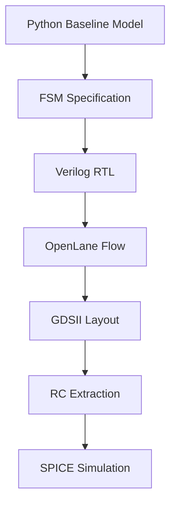
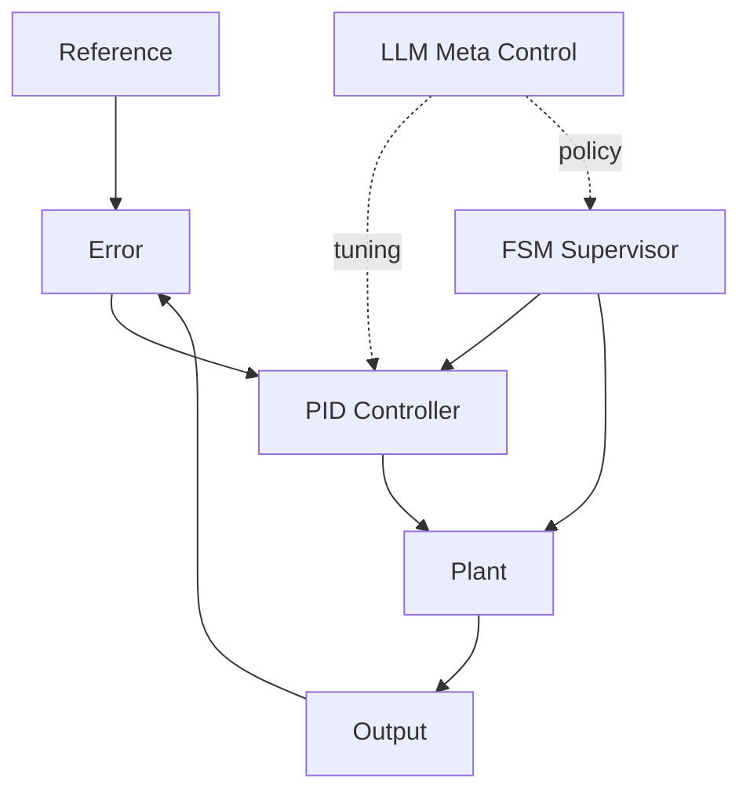

# 📚 AITL Silicon Pathway — Documentation Index
Welcome to the official documentation site for **AITL Silicon Pathway**.  
This page serves as the root index for all chapters, diagrams, and reference materials.

---

## 🔗 Official Links

| Language | GitHub Pages 🌐 | GitHub 💻 |
|----------|----------------|-----------|
| 🇺🇸 English | [](https://samizo-aitl.github.io/aitl-silicon-pathway/) | [](https://github.com/Samizo-AITL/aitl-silicon-pathway/tree/main) |

> ⚠ **Diagram Rendering Notice**  
>  
> The system pathway diagram above is written in **Mermaid**.  
> Due to current limitations of **GitHub Pages**, Mermaid diagrams are **not rendered** on this site.  
>  
> Please refer to the **GitHub repository view** (linked above) to see the diagram correctly rendered.

---

# 🧭 Full System Pathway



The project explores the complete engineering pipeline:

**Python → Verilog (RTL) → OpenLane → GDSII → Magic RC Extraction → SPICE Simulation**

---

# 📘 Chapter Index

| Chapter | GitHub Pages | GitHub Source | Description |
|--------|--------------|---------------|-------------|
| **Chapter 1** | [docs/chapter1](/docs/chapter1/index.md) | [/chapter1_python_model](/chapter1_python_model/index.md) | Python baseline FSM model (PID × FSM × LLM reference) |
| **Chapter 2** | [docs/chapter2](/docs/chapter2/index.md) | *none* | Formal FSM specification and Verilog RTL design |
| **Chapter 3** | [docs/chapter3](/docs/chapter3/index.md) | *none* | RTL simulation and ASIC-flow feasibility check (OpenLane concept level) |
| **Chapter 4** | [docs/chapter4](/docs/chapter4/index.md) | *none* | Formal and structural correctness of FSM (invariants, safety, equivalence) |
| **Chapter 5** | [docs/chapter5](/docs/chapter5/index.md) | *none* | Executable verification of FSM correctness (assertions, simulation, equivalence checks) |

---

# 🧩 AITL Architecture Overview



The AITL architecture consists of:

- **PID Layer** — Numerical real-time control  
- **FSM Layer** — Supervisory logic (canonical model for RTL)  
- **LLM Layer** — Adaptive meta-controller  

---

# 📄 Detailed Documentation Structure

```
docs/
├─ index.md 
├─ chapter1/
│  ├─ index.md
│  ├─ overview.md
│  ├─ python_model.md
│  ├─ fsm.md
│  ├─ api.md
│  ├─ getting_started.md
│  └─ images/
│     ├─ aitl_3layer.png
│     ├─ fsm_state_diagram.png
│     ├─ controller_data_flow.png
│     └─ step_response_timeline.png
├─ chapter2/
├─ chapter3/
├─ chapter4/
├─ chapter5/
└─ README.md
```

---

# 🔗 Quick Navigation

- 👉 [Chapter 1 — Python Baseline FSM](/docs/chapter1/index.md)  
- 👉 [Chapter 2 — FSM Specification & Verilog RTL](/docs/chapter2/index.md)  
- 👉 [Chapter 3 — Simulation & ASIC Flow Feasibility](/docs/chapter3/index.md)  
- 👉 [Chapter 4 — FSM Formal Correctness (Invariants & Safety)](/docs/chapter4/index.md)  
- 👉 [Chapter 5 — Executable Verification & Equivalence Checking](/docs/chapter5/index.md)

---

## 👤 Author

| 📌 Item | Details |
|--------|---------|
| **Name** | Shinichi Samizo |
| **Expertise** | Semiconductor devices (logic, memory, high-voltage mixed-signal)<br>Thin-film piezo actuators for inkjet systems<br>PrecisionCore printhead productization, BOM management, ISO training |
| **GitHub** | [](https://github.com/Samizo-AITL) |

---

# 📄 License

[](https://samizo-aitl.github.io/aitl-silicon-pathway/#-license)

| 📌 Item | License | Description |
|--------|---------|-------------|
| **Source Code** | [**MIT License**](https://opensource.org/licenses/MIT) | Free to use, modify, and redistribute |
| **Text Materials** | [**CC BY 4.0**](https://creativecommons.org/licenses/by/4.0/) or [**CC BY-SA 4.0**](https://creativecommons.org/licenses/by-sa/4.0/) | Attribution required; share-alike applies for BY-SA |
| **Figures & Diagrams** | [**CC BY-NC 4.0**](https://creativecommons.org/licenses/by-nc/4.0/) | Non-commercial use only |
| **External References** | Follow the original license | Cite the original source properly |

---

# 💬 Feedback

> Feedback, ideas, and discussions are welcome.

[](https://github.com/Samizo-AITL/aitl-silicon-pathway/discussions)
